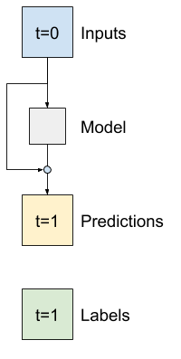

# 데이콘 비트코인 트레이더 시즌2 스터디
___
## chapter.1 - EDA(Exploratory Data Analysis)
### 데이터 공부
<a href ='./coin_eda.ipynb'>EDA 정리</a>

* 데이터 메모
```python
''' greedy feature handleing'''
# test_df = train_x_df[train_x_df['volume'] != 0]
# test_df['rest_asset'] = test_df['volume'] - test_df['tb_base_av']
# test_df['greedy'] = test_df['tb_base_av'] / test_df['volume']

# test_df2 = test_df[['time', 'coin_index', 'open', 'high', 'low', 'close', 'volume', 'trades', 'tb_base_av','rest_asset', 'greedy']]
# test_df2[['coin_index','trades', 'volume', 'tb_base_av','rest_asset', 'greedy']].head()
# test_df2[test_df2['greedy'] == 1][['coin_index','trades', 'volume', 'tb_base_av','rest_asset', 'greedy']].head()
```

```python
print(
    f'''
    {df.high.max()}
    {df.low.max()}
    {df.open.max()}
    {df.close.max()}
    
    
    {df.high.min()}
    {df.low.min()}
    {df.open.min()}
    {df.close.min()}
    
    '''
    
    ''' high - low = 변동폭 \n'''
    ''' 음봉양봉 구분 추가 가능'''
)

```
___

## chapter.2 - Season 1 model pilot
### ARIMA
<a href ='./season1_pilot.ipynb'>시즌 1 파일럿 모델링</a>

### Prophet
기존의 driving 방식은 trian_x에서 open column만 가지고 
ARIMA나 Prophet으로 연산시켜서.
y값을 추정함.


음.. 비슷한 방식으로 open 가격 데이터만을 가지고
Tree 모델이나
DNN 이나 
RNN 등을 해볼 수 있을 텐데..
60분의 데이터를 보고 

## chapter.3 - RNN modeling
<a href ='./rnn_modeling.ipynb'>RNN 모델링</a>
sample이 1208개 있고, 한 샘플당 1500개의 시리즈 구성 -> 여기서 또 1500개 375개로씩 짤라
한 sample 당 4개의 미니 세트로 구성된건데.. 

1208 * 4 = 6832 세트

6000세트는 학습시키고
382세트는 validation 

1208 샘플이 있으면 1100개 의 샘플은 학습데이터로 빼고 나머지를 split 


어차피 시간대 별 특성이 없다고 치면. 코인 인덱스가 같으면. 

datasetgenerate로 0 ~ 1000까지 샘플 가지고 오고.
1. 샘플을 가져와서 

1, 1500, 12 - 


## chapter. 4 - 실수차원 ARIMA
## chapter. 5 - Neural prophet
## chapter. 6 - tensorflow time series forecasting course study

* reference : <a href = 'https://www.tensorflow.org/tutorials/structured_data/time_series?hl=ko#%EB%8B%A8%EC%9D%BC_%EC%8A%A4%ED%85%9D_%EB%AA%A8%EB%8D%B8'>tensorflow tutorial</a>
* requirements 
    1. tensorflow 2.x 이상과
    2. 해당 텐서 버젼과 호환되는 numpy 
    3. 확인방법 : tensorflow과
    4. 내가 설치한 verison(텐서가 version2 부터는 gpu과 cpu 동시 호환을 default로 하는데, 노트북 사용자라서, cpu전용 버젼을 따로 설치함.)
        * pip install tensorflow 2.4.0-cpu
        * pip install numpy-1.19.2

* 보통 에러 : ㄴ엄어마ㅣㅓㅇㅁ
* 에러창 지우는 방법 : 
```python
# tensorflow import 하기 전에, define 해야 함.
import warnings
warnings.filterwarnings('ignore')
```
___
### 스터디 1단계 - 전반적인 코드 리뷰 및 시범운용
우선 9번 코인(bitcoin이라 추정) 중 한 sample만 가지고 study 진행   
* 의문점1 : Normalized를 시키는 게 맞을 지는 의문임. 이미 가격 data columns들이 time index가 1380인 시점을 기준으로 부분 정규화가 되어있음.   
* 배운점1 : 전반적인 class를 사용해서 데이터를 처리하는 방식은 크게 배울만 함. 깔끔하게 정리되고, 여러 모델에 적용하기 용이함.
* 배운점2 : Residual networks는 기본적으로 AR(auto-regression)이 기본 가정인듯. future은 이전 과거 데이터로 부터 생성된다. 즉, data간의 시게열 변화가 작아야 더욱 더 효용성 있는 model임.



> 시계열 분석에서는 다음 값을 예측하는 대신 다음 타임스텝에서 값이 어떻게 달라지는 지를 예측하는 모델을 빌드하는 것이 일반적입니다. 마찬가지로 딥러닝에서 "잔여 네트워크(Residual networks)" 또는 "ResNets"는 각 레이어가 모델의 누적 결과에 추가되는 아키텍처를 나타냅니다. **이것은 변화가 작아야 한다는 사실을 이용하는 방법입니다.**

* 결과 : 한 샘플만 가지고 적용할 때에는 크게 효과 있어보이지는 않음. 한 코인당 하나의 모델을 만드는 방식으로 샘플을 train, validation, test 구간으로 나누어 다시 재적용해 볼 필요가 있음.

