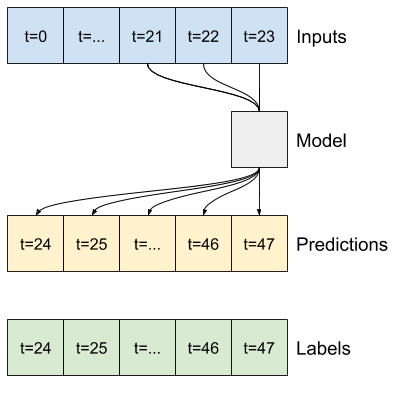

## 데이콘 비트코인 트레이더 시즌2 스터디
<p align='center'>
</img>
</p>

### index 
- Chapter. 1 - EDA
- Chapter. 2 - Season 1 pilot
- Chapter. 3 - Personal modeling prediction
- Chapter. 4 - Data preprocess
- Chapter. 5 - Pytorch modeling prediction
- Chapter. 6 - Experiments & Simulation
- Reference
___
### Chapter. 1 - EDA(Exploratory Data Analysis)
#### train_x_df EDA 과정 설명
* sample_id : 한 시퀀스 샘플, 한 시퀀스는 1380분의 시계열 데이터로 구성
 아래 예시

<p align='center'>
</img><br>
Figure. 데이터 샘플 예시
</p>

#### In one sample, dataset description
- X : 1380분(23시간)의 연속 데이터
- Y : 120분(2시간)의 연속 데이터
- 23시간 동안의 데이터 흐름을 보고 앞으로의 2시간 데이터를 예측하는 것
- sample_id는 7661개의 세트 구성, 각 세트는 독립적인 dataset 
- coin_index는 총 10개 종류로 구성(index number is 0 ~ 9)

#### 코인별 샘플 개수
- 각 코인별로 샘플 개수는 다름
- 9, 8번의 샘플 수가 가장 많음


<p align='center'>
</img><br>
Figure. 코인 인덱스 별 데이터 샘플 개수
</p>


#### 모르는 데이터 피쳐 조사
- 'Volume' - ' Taker buy base asset volume' = ' Maker buy base asset volume'
> source by : https://www.binance.kr/apidocs/#individual-symbol-mini-ticker-stream
- quote asset volume = coin volume / btc volume
> quote asset volume = Volume expressed in quote asset units. For pair DOGE/ BTC the volume is shown in BTC , instead of DOGE.

> 예시) 가상화폐/거래화폐에서 거래화폐의 양<br>
> 한국돈으로 돌고돌아 계산(100만)<br>
> ex) btc/usdt 면 usdt의 가치 57000*1200에서의 qav = 100만/1200 => 8만xxx<br>
> btc/krw면 btc의 가치 7400만에서의 qav = 100만<br>
> tb_base_av<br>
> coin / xxxxx<br>
> volume / quote_av<br>
> 0 = 19.xxxxx<br>
> 1 = 0.028xxxxx<br>
> 2 = 0.268xxxxx<br>
> 3 = 0.238 xxxxx<br>
> 4 = 2.1312xxxx<br>
> 5 = 52.1123xxxx(**maximum coin**)<br>
> 6= 0.22421<br>
> 7= 19.3821<br>
> 8 = 0.003426<br>
> 9 = 0.00013(**minimum coin**)<br>
> ====> **작을수록 비싼 코인으로 추정**

#### Open price outlier problem 
- 샘플 내 outlier 너무 빈도가 적고, regression으로 학습하기 어려움(raw, smoothing, log smoothing 별 차이 없음)

<p align='center'>
</img><br>
Figure. open price distribution plot
</p>

<p align='center'>
</img><br>
Figure. price box plot
</p>

- open price outlier detection tempary method code
```python
for temp_arr in outlier_arr:
    plt.plot(temp_arr, label = 'True series')
    plt.ylim(open_arr.min(), open_arr.max())
    plt.legend()
    plt.show()

filtered_y_df = raw_y_df[~raw_y_df["sample_id"].isin(outlier_list)]
```

<p align='center'>
</img><br>
Figure. outlier range boxplot
</p>


#### EDA code
[coin eda code link](./codes/Coin_EDA.ipynb)

<br>

#### Data handling memo 
1. greedy feature add based on taker volumn data
```python
''' greedy feature handleing'''
# test_df = train_x_df[train_x_df['volume'] != 0]
# test_df['rest_asset'] = test_df['volume'] - test_df['tb_base_av']
# test_df['greedy'] = test_df['tb_base_av'] / test_df['volume']

# test_df2 = test_df[['time', 'coin_index', 'open', 'high', 'low', 'close', 'volume', 'trades', 'tb_base_av','rest_asset', 'greedy']]
# test_df2[['coin_index','trades', 'volume', 'tb_base_av','rest_asset', 'greedy']].head()
# test_df2[test_df2['greedy'] == 1][['coin_index','trades', 'volume', 'tb_base_av','rest_asset', 'greedy']].head()
```

2. 변동폭 feature add based on high and low price difference
```python
print(
    f'''
    {df.high.max()}
    {df.low.max()}
    {df.open.max()}
    {df.close.max()}
    
    
    {df.high.min()}
    {df.low.min()}
    {df.open.min()}
    {df.close.min()}
    
    '''
    
    ''' high - low = 변동폭 \n'''
    ''' 음봉양봉 구분 추가 가능'''
)
```
___
### Chapter. 2 - Season 1 model pilot
- sample id = 0, open data series로만 모델링 진행
#### ARIMA modeling
- ARIMA arg meanings : https://otexts.com/fppkr/arima-forecasting.html
- ARIMA python code
```python
# ARIMA model fitting : model arguments 는 임의로 진행
model = ARIMA(x_series, order=(3,0,1))
fit  = model.fit()
pred_by_arima = fit.predict(1381, 1380+120, typ='levels')
```
#### Prophet modeling
- Time Series Forecasting — ARIMA vs Prophet : https://medium.com/analytics-vidhya/time-series-forecasting-arima-vs-prophet-5015928e402a
- facebook github : https://facebook.github.io/prophet/docs/quick_start.html
- prophet 설명 블로그 : https://zzsza.github.io/data/2019/02/06/prophet/

- prophet python code
```python
# pprophet 모델 학습 
prophet = Prophet(seasonality_mode='multiplicative', 
                  yearly_seasonality=False,
                  weekly_seasonality=False, daily_seasonality=True,
                  changepoint_prior_scale=0.06)
prophet.fit(x_df)

future_data = prophet.make_future_dataframe(periods=120, freq='min')
forecast_data = prophet.predict(future_data)

```

##### result plot
<p align='center'>
</img><br>
Figure. season 1 model pilot
</p>

##### season 1 pilot code
season 1 pilot code link : <a href ='./codes/Season1_Pilot.ipynb' target="_blank">"here"</a>

___
### Chapter. 3 - Personal modeling prediction
- 기존의 driving 방식처럼 trian_x에서 open column만 활용하여 yhat predict함.

#### ARIMA trial
- 우선 기존 ARIMA 방법을 Baseline으로 잡고, 진행
- hyperparameter p,d,q는 임의로 잡음
<br>

- ARIMA python code
```python
def train(x_series, y_series, args):
    
    model = ARIMA(x_series, order=(2,0,2))
    fit  = model.fit()
    
    y_pred = fit.predict(1381, 1380+120, typ='levels')
    error = mean_squared_error(y_series, y_pred)
    plotting(y_series, y_pred, args.sample_id)

    return error*10E5
```
##### result
<p align='center'>
<br>
Figure. open price ARIMA prediction plot
</p>

Colab link : https://colab.research.google.com/drive/1x28Mi9MSqqkSTO2a8UU0wXDzgXNy2WT9?usp=sharing<br>


#### Prophet trial
- hyperparameter는 임의로 설정, seasonality는 코인 데이터가 addtitive 보다는 multiplicative가 적합하다고 판단
<br>

- prophet python code
```python
prophet= Prophet(seasonality_mode='multiplicative',
                  yearly_seasonality='auto',
                  weekly_seasonality='auto', daily_seasonality='auto',
                  changepoint_range=0.9,  
                  changepoint_prior_scale=0.1  # 오버피팅, 언더피팅을 피하기 위해 조정
                )

prophet.add_seasonality(name='first_seasonality', period=1/12, fourier_order=7) # seasonality 추가
prophet.add_seasonality(name='second_seasonality', period=1/8, fourier_order=15) # seasonality 추가

prophet.fit(x_df)

future_data = prophet.make_future_dataframe(periods=120, freq='min')
forecast_data = prophet.predict(future_data)
```
##### sample_id = 1, dataset 예측 결과
<p align='center'>
<br>
Figure. open price prophet prediction plot
</p>
<br>
Colab link : https://colab.research.google.com/drive/1dDf6AIln31catWWDsrB_lbL-0M5DsZTd?usp=sharing<br>


#### Neural Prophet trial
- hyperparameter 임의로 잡음, seasonality mode는 이전 prophet model처럼 mulplicative로 진행
<br>

- neural prophet python code
```python
def prophet_preprocessor(x_series):
    
    # start time initialization
    start_time = '2021-01-01 00:00:00'
    start_dt = datetime.datetime.strptime(start_time, '%Y-%m-%d %H:%M:%S')

    # datafram 만들기
    x_df = pd.DataFrame()
    # 분당 시간 데이터 시리즈 입력
    x_df['ds'] = [start_dt + datetime.timedelta(minutes = time_min) for time_min in np.arange(1, x_series.shape[0]+1).tolist()]
    # 가격 데이터 시리즈 입력
    x_df['y'] = x_series.tolist()

    return x_df


def train(x_series, y_series, **paras):
    
    x_df = prophet_preprocessor(x_series)
    
    model = NeuralProphet(
                          n_changepoints = paras['n_changepoints'],
                          changepoints_range = paras['changepoints_range'],
                          num_hidden_layers = paras['num_hidden_layers'],
            
                          learning_rate = 0.1, epochs = 40, batch_size = 32,
                          seasonality_mode = 'multiplicative', 
                          yearly_seasonality = False, weekly_seasonality = False, daily_seasonality = False,
                          normalize='minmax'
                         )
    
    model.add_seasonality(name='first_seasonality', period=1/24, fourier_order=5) 
    model.add_seasonality(name='second_seasonality', period=1/12, fourier_order=10)

    metrics = model.fit(x_df, freq="min")

    future = model.make_future_dataframe(x_df, periods=120)
    forecast = model.predict(future)
    error = mean_squared_error(y_series, forecast.yhat1.values[-120:])

    return error

```
Colab link : https://colab.research.google.com/drive/1E38kkH2mfFgnGKj89t2mLZV6xg7rPQl8?usp=sharing

#### Fractional differencing ARIMA trial
- 일반적으로, 차분을 해버리면 시즈널이 생기지만 그 만큼 기존 데이터가 변형되어 정보 손실이 생김. 이를 커버하기 위해, 실수 차분의 개념이 도입

- 실수 차원의 차분 시계열 : https://m.blog.naver.com/chunjein/222072460703
<br>

- fractional differecing ARIMA code
```python
#차분용 함수
def getWeights_FFD(d, size, thres):
    w = [1.]  # w의 초깃값 = 1

    for k in range(1, size):

        w_ = -w[-1] * (d - k + 1) / k  # 식 2)를 사용했다.

        if abs(w[-1]) >= thres and abs(w_) <= thres:
            break
        else:
            w.append(w_)

    # w의 inverse
    w = np.array(w[::-1]).reshape(-1, 1)
    return w


def fracDiff_FFD(series, d, thres=0.002):
    '''
    Constant width window (new solution)

    Note 1: thres determines the cut-off weight for the window
    Note 2: d can be any positive fractional, not necessarily bounded [0,1]
    '''

    # 1) Compute weights for the longest series
    w = getWeights_FFD(d, series.shape[0], thres)

    width = len(w) - 1

    # 2) Apply weights to values
    df = []
    seriesF = series

    for iloc in range(len(w), seriesF.shape[0]):
        k = np.dot(w.T[::-1], seriesF[iloc - len(w):iloc])
        df.append(k)

    df = np.array(df)
    return df, w

# 실수 차분 예시
x_series = train_x_array[idx,:,data_col_idx]

# fractional differecing 
fdiff, fdiff_weight = fracDiff_FFD(x_series, d=0.2, thres=0.002)
differencing_x_series = fdiff.reshape(fdiff.shape[0],)

# ARIMA modeling
model = ARIMA(differencing_x_series, order =(2,0,2))
fitted_model = model.fit()
pred_y_series = fitted_model.predict(1,120, type='levels')

# scale control : 실수 차분을 하면 시계열성 및 정보는 어느 정도 보존되지만, 데이터 스케일이 달라짐. 1380분의 데이터가 1이 되도록 맞춰줌.
first_value = pred_y_series[0]
scale_controler = 1 / first_value
scaled_pred_y_series = scale_controler * pred_y_series
```
Colab link : https://colab.research.google.com/drive/19hrQP6nI-KgVwWu9Udp2fbntYCjpnHG9?usp=sharing

#### Keras RNN models trial
- 비슷한 방식으로 open 가격 데이터만이 아닌, feature까지 활용해서 driving
- keras moduler LSTM 이랑 GRU 시도

##### keras LSTM code
```python
#모델학습
class CustomHistory(keras.callbacks.Callback):
    def init(self):
        self.train_loss = []
        self.val_loss = []
        
    def on_epoch_end(self, batch, logs={}):
        self.train_loss.append(logs.get('loss'))
        self.val_loss.append(logs.get('val_loss'))


def train(x_train, y_train, n_epoch, n_batch, x_val, y_val):

    #모델
    model = Sequential()
    model.add(LSTM(128, return_sequences=True, input_shape= (x_train.shape[1],x_train.shape[2] )))
    model.add(LSTM(64, return_sequences=False))
    model.add(Dense(25, activation='relu'))
    model.add(Dense(1))

    # 모델 학습과정 설정하기
    model.compile(loss='mean_squared_error', optimizer='adam')

    # 모델 학습시키기
    custom_hist = CustomHistory()
    custom_hist.init()

    #모델 돌려보기
    model.fit(x_train, y_train, epochs=n_epoch, batch_size=n_batch, shuffle=True, callbacks=[custom_hist], validation_data=(x_val, y_val), verbose=1)

    return model
```
##### result
<p align='center'>
<br>
Figure. Keras LSTM predition plot
</p>
<br>

Colab link : https://colab.research.google.com/drive/1oCCXpJSlLXDs6x968eYrIPQtzEo0klMq?usp=sharing<br>

##### keras GRU code
```python
# GRU로도 시도 해봄.
model = keras.models.Sequential(
    [
     keras.layers.Bidirectional(layers.GRU(units = 50, return_sequences =True), input_shape=(x_frames, 1)), 
     keras.layers.GRU(units = 50),
     keras.layers.Dense(1)
    ]
)

model.compile(optimizer='adam', loss='mse')
model.summary()
```
##### result
<p align='center'>
<br>
Figure. Keras GRU predition plot
</p><br>

Colab link : https://colab.research.google.com/drive/1w2GZXVXSjRX-tlI49WAcC77szQaK_H6R?usp=sharing<br>
___
### Chapter. 4 - Data preprocess
#### Data smoothing
- 이후, DNN 계열의 모델링을 시도했으나, 제대로 regression이 되지 않음. -> 기존 데이터는 너무 진폭이 심해서 모델이 regression을 하기 어렵다고 판단함

- smoothing method 1 : simple exponential smoothing
> Exponential smoothing is a time series forecasting method for univariate data that can be extended to support data with a systematic trend or seasonal component.
It is a powerful forecasting method that may be used as an alternative to the popular Box-Jenkins ARIMA family of methods.

- smoothing method 2 : moving average
> Smoothing is a technique applied to time series to remove the fine-grained variation between time steps.
The hope of smoothing is to remove noise and better expose the signal of the underlying causal processes. Moving averages are a simple and common type of smoothing used in time series analysis and time series forecasting.

- smoothing python code
```python
def simple_exponetial_smoothing(arr, alpha=0.3):
    
    y_series = list()
    
    for temp_arr in arr:
        target_series = temp_arr[:, 1].reshape(-1) # open col is 1 index

        smoother = SimpleExpSmoothing(target_series, initialization_method="heuristic").fit(smoothing_level=0.3,optimized=False)
        smoothing_series = smoother.fittedvalues
        
        y_series.append(smoothing_series)
    
    return np.array(y_series)


def moving_average(arr, window_size = 10):
    
    #length = ma 몇 할지
    length = window_size
    ma = np.zeros((arr.shape[0], arr.shape[1] - length, arr.shape[2]))

    for idx in range(arr.shape[0]):
        for i in range(length, arr.shape[1]):
            for col in range(arr.shape[2]):
                ma[idx, i-length, col] = arr[idx,i-length:i, col].mean() #open
            
    return ma[:, :, 1] # open col is 1
```
##### smoothing result
<p align='center'>

Figure. price data smoothing plot
</p>

#### Data discretize
- y값 open 데이터가 진폭이 너무 큰 outlier 데이터가 너무 많아서, true y을 prediction 하는 것보다 y 값의 패턴 양상만을 학습하는 방법으로 바꿔 driving
- discretize method : KBinsdiscretizer library(in scikit-learn)
<br>

- kbinsdiscretizer python code
```python
from sklearn.preprocessing import KBinsDiscretizer
kb = KBinsDiscretizer(n_bins=10, strategy='uniform', encode='ordinal')
kb.fit(open_y_series)
#  이때 `bin_edges_` 메소드를 이용하여 저장되어진 경계값을 확인할 수 있다.
print("bin edges :\n", kb.bin_edges_ )
```
##### Discretize result
<p align='center'>
<br>
Figure. kbinsdiscretizer before & after plot
</p>


#### Data log normalization
- 데이터 인풋 시 open data 이외에 다른 feature을 같이 활용하기 위해, 다음과 같은 방법으로 normalization을 취해줌. 일반적인 scikit-learn normalizizer은 바로 사용하기에는 대회 내에서 1380분일 때의 open price를 1로 수정하면서 전반적인 전처리가 이미 한번 된 상태이기 때문에 해당 방법을 사용함.

- log normalizer python code
``` python
data = data.apply(lambda x: np.log(x+1) - np.log(x[self.x_frames-1]+1))
```
- 시계열 데이터 정규화 방법 출처 : https://github.com/heartcored98/Standalone-DeepLearning/blob/master/Lec8/Lab10_Stock_Price_Prediction_with_LSTM.ipynb(2019 KAIST 딥러닝 홀로서기 )
___

### Chapter. 5 - Pytorch modeling
#### Pytorch LSTM trial

##### Only coin 9, smoothing & LSTM
- condition
    - Only coin 9 data use
    - Data preprocess - simple exponential smoothing
    - LSTM layer is 1
<br>

- pytorch LSTM python code
```python
class LSTM(nn.Module):
    
    def __init__(self, input_dim, hidden_dim, output_dim, num_layers, dropout, use_bn):
        super(LSTM, self).__init__()
        self.input_dim = input_dim 
        self.hidden_dim = hidden_dim
        self.output_dim = output_dim
        self.num_layers = num_layers

        self.dropout = dropout
        self.use_bn = use_bn 
        self.lstm = nn.LSTM(self.input_dim, self.hidden_dim, self.num_layers)

        self.regressor = self.make_regressor()
        
    def init_hidden(self, batch_size):
        return (torch.zeros(self.num_layers, batch_size, self.hidden_dim),
                torch.zeros(self.num_layers, batch_size, self.hidden_dim))
    
    def make_regressor(self):
        layers = []
        if self.use_bn:
            layers.append(nn.BatchNorm1d(self.hidden_dim))
        layers.append(nn.Dropout(self.dropout))
        
        layers.append(nn.Linear(self.hidden_dim, self.hidden_dim))
        layers.append(nn.ReLU())
        layers.append(nn.Linear(self.hidden_dim, self.output_dim))
        regressor = nn.Sequential(*layers)
        return regressor
    
    def forward(self, X):
        lstm_out, self.hidden = self.lstm(X)
        y_pred = self.regressor(lstm_out[-1].view(X.shape[1], -1))
        return y_pred
```
- 모델 학습 방법 시각화

<p align='center'>
<br>
Figure. Multistep LSTM modeling(source by : tensorflow tutorial)
</p><br>

##### result
 modeling 내 한번에 120개의 y값을 출력시, 다음 그림처럼 패턴에 상관없이 같은 y값을 출력하게 됨. -> 실패

<p align='center'>
<br>
Figure. coin9 LSTM prediction
</p><br>

Colab link : https://colab.research.google.com/drive/1I0Arck8qkV4FTXnOOYMxkpZGIRKCGj7J?usp=sharing

##### Only coin 9, Slicing & LSTM
이후, 한 샘플 내 데이터를 slicing 해서 과거 120 time-series 로 이후 120 time-series를 예측하는 모델로 변형해봤지만 실패.

- one sample data slicing python code
```python
class WindowGenerator():
    ''' Dataset Generate'''
    def __init__(self, input_width, label_width, stride, data_arr, column_indices = column_indices,
                 shfit = None, label_columns=None):
    
        # Store the raw data
        self.data_arr = data_arr
        # Work out the label column indices.
        self.label_columns = label_columns
        if label_columns is not None:
            self.label_columns_indices = {name: i for i, name in enumerate(label_columns)}
        self.column_indices = column_indices
                
        # Work out the window parameters.
        self.input_width = input_width
        self.label_width = label_width
        self.shift = 1
        if shfit is not None:
            self.shift = shfit
        self.stride = stride
        
        self.label_start = self.input_width + self.shift
        self.total_window_size = self.label_start + self.label_width
        
        # input, label indices
        self.input_slice = slice(0, self.input_width)
        self.input_indices = np.arange(self.total_window_size)[self.input_slice]
        
        self.labels_slice = slice(self.label_start, None)
        self.label_indices = np.arange(self.total_window_size)[self.labels_slice]
        
        self.X_arr, self.y_arr = self.split_windows()
        
    def __repr__(self):
        return '\n'.join([
            f'Total window size: {self.total_window_size}',
            f'Input indices: {self.input_indices}',
            f'Label indices: {self.label_indices}',
            f'Label column name(s): {self.label_columns}'
        ])

    def split_windows(self):

        X, y = list(), list()
        sample_length = int(self.data_arr.shape[0])
        split_length = int((self.data_arr.shape[1] - self.total_window_size)/self.stride) + 1
        
        for temp_id in range(sample_length):
            for i in range(split_length):
                
                X.append(self.data_arr[temp_id, (i*self.stride) : (i*self.stride)+self.input_width])
                y.append(self.data_arr[temp_id, (i*self.stride)+self.label_start : (i*self.stride)+self.total_window_size])

        return np.array(X), np.array(y)

    def __len__(self):
        return len(self.X_arr)

    def __getitem__(self, idx):
        
        X = self.X_arr[idx, :, :]
        y = self.y_arr[idx, :, :]

        return X, y
```
Colab link : https://colab.research.google.com/drive/11s1KCtT8NPvsaOR-1mYaR66lneQ1yxU7?usp=sharing

##### All coin, Log norm & LSTM
이후, 모든 코인으로 확장해서 재적용 시도
- condition
    1. all coin data use
    2. No data preprocess
    3. log normalization
    3. LSTM layer is 1
<br>

##### result
이전 모델 구조는 그대로 진행하였고, 데이터 세트만 기존에 9번 코인 데이터에서 코인에 상관없이 모든 데이터 세트를 적용함. -> 어차피 코인별 각기 다른 데이터 패턴 양상이 아닌, 코인과 무관하게 가격 데이터의 움직임은 그냥 일정 패턴 별로 나뉠 것으로 예상 -> 제대로 된 학습조차 안 되며, 코인 가격 자체가 seasonal아 아예 없어서 LSTM regression이 무의미한 것으로 판정


<p align='center'>
<br>
Figure. LSTM prediction with all coin data
</p><br>

Colab link : https://colab.research.google.com/drive/1blDNKqxy6GvTkR-rq8pjn9eUL0IUpShi?usp=sharing<br>

##### All coin, outlier remove & LSTM
이후, all coin regression시, 시즈널이 아예 벗어나는 데이터들 때문에 학습이 안되는 것이라 판단하여 y series 중에서 min-max range가 특정 기준(outlier criteria)가 넘는 샘플은 제외하고 학습 시도

- outlier remove python code
```python
def outlier_detecter(raw_y_arr, outlier_criteria = 0.03):

    open_arr = raw_y_arr[:, :, 1] #open col is 1

    outlier_list = []
    openrange_list = []

    for idx, temp_arr in enumerate(open_arr):
    
        temp_min = temp_arr.min()
        temp_max = temp_arr.max()
        temp_arr_range = temp_max - temp_min
        openrange_list.append(temp_arr_range)

        if temp_arr_range > outlier_criteria:
            outlier_list.append(idx)
            print(f'{idx}번째 open series is outlier sample!')
            print(f'temp array range is {temp_arr_range:.3}\n')
            

    return outlier_list, np.array(openrange_list)
```

<p align='center'>
<br>
Figure. outlier remove & LSTM prediction
</p><br>


##### All coin, kbinsdiscretize & LSTM
outlier를 굳이 제거하지 않고, 예측해야 할 y series를 계층화시켜서 패턴을 학습시키면 몇 개의 패턴으로 예측가능할 것으로 생각했으나 실패 -> 이런 방법으로 적용시, classification문제로 변형되어 푸는 것이 맞을 듯 싶음.

- kbindiscretize python code
```python
def kbin_discretizer(input_array):

    kb = KBinsDiscretizer(n_bins=10, strategy='uniform', encode='ordinal')
    processed_data = np.zeros((input_array.shape[0], input_array.shape[1], 1))
    
    for i in range(input_array.shape[0]):
        # coin_index_export args : (input_array, coin_num)
        globals()['processing_array{}'.format(i)] = input_array[i,:,1]
        
        #globals()['outliery_array{}'.format(i)] = train_y_array[outlier[i],:,1]
        kb.fit(globals()['processing_array{}'.format(i)].reshape(input_array.shape[1],1))
        globals()['processed_fit{}'.format(i)] = kb.transform(globals()['processing_array{}'.format(i)].reshape(input_array.shape[1],1))
        
        #globals()['outliery_fit{}'.format(i)] = kb.transform(globals()['outliery_array{}'.format(i)].reshape(120,1))
        processed_data[i,:,:] = globals()['processed_fit{}'.format(i)]
        
    return processed_data
```

##### All coin, log norm & Conv1d-LSTM(모델 변경)
기존 LSTM 방법으로는 너무 데이터 시퀀스가 길어서(lstm time sequence length = 1380)모델이 학습하기 어렵다고 생각하여, Conv1d로 특정 구간씩 split하여 특징을 추출하고 이를 LSTM에 반영하면 학습이 가능해질 수 있다고 생각하여 driving

- Conv1d-LSTM modeling code
```python
class CNN_LSTM(nn.Module):
    
    def __init__(self, input_dim, hidden_dim, output_dim, n_layers):
        super(CNN_LSTM, self).__init__()
    
        self.input_dim = input_dim
        self.hidden_dim = hidden_dim
        self.output_dim = output_dim
        self.num_layers = n_layers

        self.conv1 = nn.Conv1d(args.input_dim, args.hidden_dim, kernel_size = 10)
        self.pooling1 = nn.MaxPool1d(2, stride = 5)
        self.conv2 = nn.Conv1d(args.hidden_dim, args.hidden_dim // 2, kernel_size = 5)
        self.pooling2 = nn.MaxPool1d(4, stride = 4)
        
        self.norm = nn.BatchNorm1d(32)
        
        self.lstm = nn.LSTM(32, 128, self.num_layers, batch_first = True, bidirectional = True)
        self.linear = nn.Linear(256, args.output_dim)
        self.flatten = nn.Flatten()
        
    def init_hidden(self, batch_size):
        return (torch.zeros(self.num_layers, batch_size, self.hidden_dim),
                torch.zeros(self.num_layers, batch_size, self.hidden_dim))
    
    
    def forward(self, X):
        
        # input은 (Batch, Feature dimension, Time_step)순
        output = F.relu(self.conv1(X))
        output = self.pooling1(output)
        output = F.relu(self.conv2(output))
        output = self.pooling2(output)
        # output = self.flatten(output)

        # [Batch_size, Seq_len, Hidden_size]
        # x_input.reshape(1, -1, self.output_dim
        # torch.Size([16, 32, 135])
        # torch.Size([16, 135, 32])
        
        output, self.hidden = self.lstm(output.reshape(args.batch_size, -1, 32))
        y_pred = self.linear(output[:, -1, :])
        
        return y_pred

```

<p align='center'>

Figure. Conv1d-LSTM prediction
</p><br>

#### RNN 모델링 결론
1. normalization이나 smoothing의 문제가 아닌, 애초에 데이터가 주기성이 없어서 샘플 별로 데이터를 regression 하는 방법의 방향이 틀림. 
2. LSTM과 같은 RNN 계열의 모델들은 패턴을 학습하는 것으로, onestep이 아닌 multistep에서는 너무 동일한 결과를 출력하게 됨.
3. 해당 문제를 특정 패턴을 학습하게 하기 위해서는, discretize시켜서 classification 문제로 접근하는 것도 하나의 방법(향후 시즌3에서 검토)
4. regression 문제로 풀기 위해서는 일반적인 time-series forcasting 모델(ARIMA or Prophet)처럼 한 샘플 내 open data seriees를 가지고 onestep씩 학습 후 이를 target length(120min)만큼 loop하여 시도해야 함(향후 시즌3에서 검토)
___

### Chapter. 6 - Experiments & Simulation
#### Experiment list
- ARIMA Experiment code : <a herf='.codes/ARIMA_Experiment.ipynb'>"here"</a>
- Neural Prophet codes
    1. Basic : <a herf='./codes/Neural_Prophet_Basic.ipynb.ipynb' target="_blank">"here"</a>
    2. Grid search : <a herf='./codes/Neural_Prophet_Grid_search.ipynb.ipynb.ipynb' target="_blank">"here"</a>
    3. Best parameter : <a herf='./codes/Neural_Prophet_Best-parameters.ipynb.ipynb.ipynb' target="_blank">"here"</a>
    4. Experiment : <a herf='./codes/Neural_Prophet_Experiment.ipynb' target="_blank">"here"</a>
-  Pytorch Study
    1. LSTM & Kbins regressor : <a herf='./codes/Pytorch_LSTM_Kbins.ipynb' target="_blank">"here"</a>
    2. LSTM & log norm regressor : <a herf='./codes/Pytorch_LSTM_Log-y-series.ipynb' target="_blank">"here"</a>
    3. Seq2Seq regressor : <a herf='./codes/Pytorch_Seq2Seq_One-feature.ipynb' target="_blank">"here"</a>
    4. Conv1d-LSTM classifier : <a herf='./codes/Pytorch_Conv1d_Classification.ipynb' target="_blank">"here"</a>
- Pytorch Colabs
    1. LSTM & smoothing : https://colab.research.google.com/drive/1uXBoRAMEza3Q0MRIrY33FKDJmN3lSKsi?usp=sharing
    2. Conv1d-LSTM : https://colab.research.google.com/drive/1UfPfdf6WSuYl4JYR2lMgdqRq7rAW8qIz
    2. LSTM & outlier remover : https://colab.research.google.com/drive/1lnj7t92-yEGE-U4NngMSIyu72pgvSQ34?usp=sharing
    3. LSTM & log normal : https://colab.research.google.com/drive/1blDNKqxy6GvTkR-rq8pjn9eUL0IUpShi?usp=sharing

#### Simulation program
Coin investing simulator code : <a herf='./codes/simulator.py' target="_blank">"here"</a>
___
#### 이후 시즌 3 진행 방향

##### modeling - Data dicretize & classification driving
- 해당 문제를 최고점 패턴 분류 모델로 변형하여 학습
- y값 구간 내 open price 최고점을 labling
- 모델은 1380분 간의 input 패턴에 따라, 최고점인 lable을 분류
- Pytorch Conv1d + bidirectional LSTM
<br>

##### modeling - Open data series regression by one sample
- 일반적인 time-series forcasting 모델(ARIMA or Prophet)처럼 한 샘플 내 open data seriees를 가지고 onestep씩 학습 후 이를 target length(120min)만큼 looping
- smoothing 및 fractional differecing, log normalization 적용
- moving average 재적용
- 특정 분류 불가할 것 같은 outlier data sample remove
- Pytorch Conv1d + bidirectional LSTM
<br>

##### 메모
- Residual modeling
> 시계열 분석에서는 다음 값을 예측하는 대신 다음 타임스텝에서 값이 어떻게 달라지는 지를 예측하는 모델을 빌드하는 것이 일반적입니다. 마찬가지로 딥러닝에서 "잔여 네트워크(Residual networks)" 또는 "ResNets"는 각 레이어가 모델의 누적 결과에 추가되는 아키텍처를 나타냅니다. **이것은 변화가 작아야 한다는 사실을 이용하는 방법입니다.**
<br>

- Gloden cross strategy
> 예측된 구간 내 골든크로스가 발생한다고 예측이 되면 1381때 1로 구매 아니면 0 으로 패스 
> 그리고 구매이후 데드크로스가 발생 시 전부 판매하면 안정적인 전략 가능 -> 가능할 지는 의문

- Simply Classification
> 최고점 y 값 lable을 120이 아닌, 해당 time-length를 압축 또한, 분류 문제로 풀 경우 무조건 사지 말고 맞출 확률에 cap을 씌워서 가능성 높은 거만 사는 방법으로 확인

- Conv1d
> 1d CNN은 더 큰 filter size를 써도 된다.
> 1d CNN은 더 큰 window size를 써도 된다.
> filter size로 일반적으로 7 or 9가 선택된다.


### Reference
1. Time-Series Forecasting: NeuralProphet vs AutoML: https://towardsdatascience.com/time-series-forecasting-neuralprophet-vs-automl-fa4dfb2c3a9e
<br>

2. Techniques to Handle Very Long Sequences with LSTMs : https://machinelearningmastery.com/handle-long-sequences-long-short-term-memory-recurrent-neural-networks/
    > A reasonable limit of 250-500 time steps is often used in practice with large LSTM models.

3. Neural prophet baseline : https://dacon.io/codeshare/2492
<br>

4. 예보 데이터 전처리와 선형보간 : https://dacon.io/competitions/official/235720/codeshare/2499?page=1&dtype=recent
    > 트렌드 추출해서 interpolation 처리 후 반영 방법

5. ARIMA 원리 설명: https://youngjunyi.github.io/analytics/2020/02/27/forecasting-in-marketing-arima.html
<br>

6. facebook prophet : https://facebook.github.io/prophet/docs/quick_start.html#python-api
    > **prophet changepoint range의 의미** 
    100%으로 하면 오버피팅 되긴 할듯, By default changepoints are only inferred for the first 80% of the time series in order to have plenty of runway for projecting the trend forward and to avoid overfitting fluctuations at the end of the time series. This default works in many situations but not all, and can be changed using the changepoint_range argument.

    > **prophet changepoint_prior_scale의 의미** 
    이상치반영정도? 같은 느낌, If the trend changes are being overfit (too much flexibility) or underfit (not enough flexibility), you can adjust the strength of the sparse prior using the input argument changepoint_prior_scale. By default, this parameter is set to 0.05

7. Cryptocurrency price prediction using LSTMs | TensorFlow for Hackers (Part III) : https://towardsdatascience.com/cryptocurrency-price-prediction-using-lstms-tensorflow-for-hackers-part-iii-264fcdbccd3f
<br>

8. tensorflow time-series forecasting tutorial : https://www.tensorflow.org/tutorials/structured_data/time_series?hl=ko
<br>

9. 시계열 예측 패키지 Prophet 소개 : https://hyperconnect.github.io/2020/03/09/prophet-package.html
<br>

10. fourie order meaning in prophet : https://medium.com/analytics-vidhya/how-does-prophet-work-part-2-c47a6ceac511
    > m.add_seasonality(name='first_seasonality', period= 1/24 , fourier_order = 7) 1/24 가 1일을 24등분해서 1시간 마다의 시즈널을 입히는 것
    m.add_seasonality(name='second_seasonality', period=1/6, fourier_order = 15)  1/6 하면 1일을 6등분해서 4시간 마다의 시즈널을 입히는 것

11. [ML with Python] 4.구간 분할/이산화 & 상호작용/다항식  - https://jhryu1208.github.io/data/2021/01/11/ML_segmentation/
<br>

12. A Simple LSTM-Based Time-Series Classifier : https://www.kaggle.com/purplejester/a-simple-lstm-based-time-series-classifier
<br>

13. PyTorch RNN 관련 티스토리 블로그 : https://seducinghyeok.tistory.com/8
<br>

14. [PyTorch] Deep Time Series Classification : https://www.kaggle.com/purplejester/pytorch-deep-time-series-classification/notebook
<br>

15. PyTorch로 시작하는 딥 러닝 입문 wicidocs : https://wikidocs.net/64703
<br>

16. scikit-learn kbins docs : https://scikit-learn.org/stable/modules/generated/sklearn.preprocessing.KBinsDiscretizer.html
<br>

17. Pytorch로 CNN 구현하기 티스토리 블로그 : https://justkode.kr/deep-learning/pytorch-cnn
<br>

18. CNN을 활용한 주가 방향 예측 : https://direction-f.tistory.com/19
<br>

19. Bitcoin Time Series Prediction with LSTM : https://www.kaggle.com/jphoon/bitcoin-time-series-prediction-with-lstm
<br>

20. 시즌 1, CNN 모델 팀 : https://dacon.io/competitions/official/235740/codeshare/2486?page=1&dtype=recent
<br>

21. A Gentle Introduction to Exponential Smoothing for Time Series Forecasting in Python : https://machinelearningmastery.com/exponential-smoothing-for-time-series-forecasting-in-python/
<br>

22. statsmodels docs : https://www.statsmodels.org/stable/examples/notebooks/generated/exponential_smoothing.html